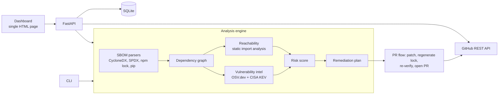

# SupplyGuard

**From vulnerable dependency to verified remediation.**

SupplyGuard is an application-aware SBOM risk auditor. It parses a project's dependency inventory, looks up known vulnerabilities in OSV.dev, decides whether the application's code can actually reach each vulnerable package, ranks findings by application risk rather than CVSS alone, and can open a verified remediation pull request on GitHub for human review.

## Why normal CVE scanners are not enough

A scanner that reports every CVE in your dependency tree gives you a list, not a priority. A critical flaw in a package your code never loads is less urgent than a medium flaw in a package that is imported by a public route. SupplyGuard therefore:

1. Traces **reachability** from your application's entry points through its imports and the lockfile graph.
2. Scores each finding with a **risk score (0-100)** built from named factors (CVSS, reachability, known exploitation, internet exposure, direct vs. transitive, fix availability, depth). Unreachable code is capped at 39.
3. Creates a **remediation PR** only after re-checking the patched lockfile against live vulnerability data.

## Honesty guarantees

- Failed vulnerability lookups are reported as failed. They are never treated as "no vulnerabilities".
- If the vulnerability source is unavailable, the security score is withheld.
- Reachability without source code is UNKNOWN, never NOT_REACHABLE.
- Dynamic imports or unresolved imports downgrade absence claims to UNKNOWN.
- Each result carries its data source (live or cache).

## Architecture



Pipeline order: SBOM → components → vulnerability lookup → reachability → risk → remediation → report.

## Install and run

Requirements: Python 3.11+, Node.js with npm (only for PR creation).

```bash
pip install -r backend/requirements.txt
./run.sh                             # http://localhost:8000
python -m app.cli scan examples/vulnerable-app --out reports/
python -m pytest -q backend/tests
./scripts/preflight.sh               # checks connectivity and configuration before a demo
```

Configuration is through environment variables only:

| Variable | Purpose |
|---|---|
| `GITHUB_TOKEN` | Needed only to create PRs. Never logged or returned. |
| `OSV_URL` | Vulnerability API (default `https://api.osv.dev/v1/query`) |
| `KEV_URL` | CISA KEV feed |
| `SUPPLYGUARD_DB`, `SUPPLYGUARD_CACHE` | SQLite paths |
| `SUPPLYGUARD_RATE_LIMIT` | Requests per minute per client (default 60) |

## API

| Method | Path | Purpose |
|---|---|---|
| GET | `/api/health` | Status and configuration (no secrets) |
| POST | `/api/scan/sbom` | Upload an SBOM or lockfile |
| POST | `/api/scan/repository` | Upload a zipped repository (enables reachability) |
| GET | `/api/scans/{id}` | Full report |
| GET | `/api/scans/{id}/components`, `/vulnerabilities`, `/dependency-graph`, `/risk` | Slices of the report |
| GET | `/api/scans/{id}/report.md` | Markdown report |
| GET | `/api/vulnerabilities/{finding_id}` | One finding |
| POST | `/api/remediation` | Remediation plans with diffs |
| POST | `/api/github/create-pr` | Verified remediation PR (never auto-merged) |

## Security of the tool itself

- Uploaded archives are extracted with traversal, absolute-path, symlink, zip-bomb, size, and entry-count checks.
- Uploaded project code is never executed. Lockfile regeneration uses `--ignore-scripts`.
- Upload size limits, rate limiting, and strict validation of owner, repository, branch, and scan identifiers.
- The GitHub token comes only from the environment.
- Outbound requests go only to the configured OSV, KEV, and GitHub endpoints.

Known limitations are listed in the report itself and in `docs/JUDGE_WALKTHROUGH.md`.

## Layout

```
backend/app/        parsers/, engines/ (reachability, risk, remediation, intel, pipeline), integrations/, api.py, cli.py
backend/tests/      48 tests: parsers, CVSS, reachability, risk, PR flow (mocked GitHub), API security
frontend/index.html dashboard
examples/           vulnerable sample project and its CycloneDX SBOM
docs/               judge walkthrough
scripts/            preflight checks
```


```
